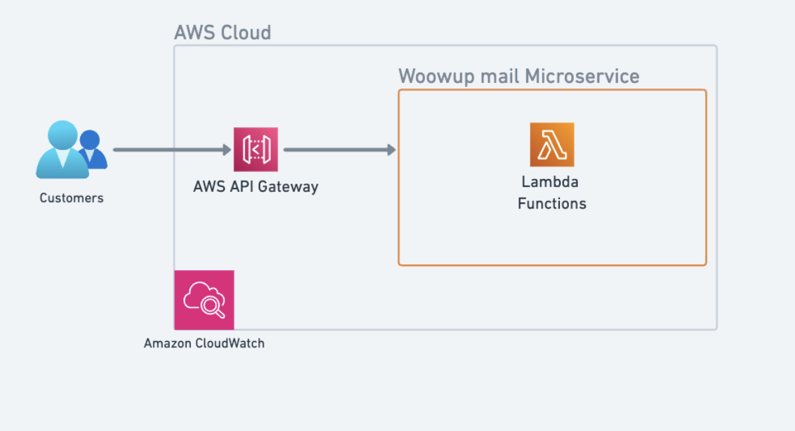

# Woowup Backend Node

This project is a Node.js backend application, primarily focused on handling email functionalities.

## Getting Started

### Prerequisites

- Node.js
- npm (Node Package Manager)

### Installation

1. Clone the repository:
   ```bash
   git clone https://github.com/Juanperezc/woowup-backend-node.git
   ```
2. Navigate to the project directory:
   ```bash
   cd woowup-backend-node
   ```
3. Install dependencies:
   ```bash
   npm install
   ```

### Configuration

- Create a `.env` file in the root directory and set up the necessary environment variables. For example:
  ```
  PORT=3000
  MAILGUN_USERNAME=your_mailgun_username
  MAILGUN_PASSWORD=your_mailgun_password
  SENDGRID_USERNAME=your_sendgrid_username
  SENDGRID_PASSWORD=your_sendgrid_password
  MAIL_FROM_ADDRESS=your_email@example.com
  ```

### Running the Application

- To start the application in development mode:
  ```bash
  npm run dev
  ```
- To build the application:
  ```bash
  npm run build
  ```
- To start the built application:
  ```bash
  npm start
  ```

### Testing

- To run tests:
  ```bash
  npm test
  ```
- To check test coverage:
  ```bash
  npm run test:coverage
  ```

## Features

- Email sending functionality with failover strategies (Mailgun and SendGrid).
- REST API endpoints for email operations.
- Swagger documentation for API endpoints.

## Considerations

- Ensure that all required environment variables are set in the `.env` file.
- The application uses CORS and is configured to allow requests from `http://localhost:3000` by default. Adjust the CORS settings in `app.ts` if necessary.

### Architecture

The project maintains a clean separation between the front-end and back-end. The backend, built with Node.js and Express, handles all server-side operations including email functionalities. The front-end, if present, would interact with these backend services via RESTful APIs. This separation allows for independent scaling and maintenance of each part.

In addition to the clear separation of concerns between the front-end and back-end, the project leverages various design patterns to enhance modularity, scalability, and maintainability. Key patterns used include:

**Singleton Pattern:** This pattern ensures that a class has only one instance and provides a global point of access to it. The EmailService class is a prime example, where it's implemented as a singleton to manage email operations throughout the application efficiently.

**Factory Pattern:** The TransporterFactory class illustrates the use of the Factory pattern. This pattern is used for creating objects without specifying the exact class of the object that will be created. It provides a way to encapsulate the instantiation logic. In this context, it's used to create different transporter instances (like Mailgun or SendGrid) based on the configuration.

**Strategy Pattern:** The use of different strategies for sending emails, encapsulated in NodemailerStrategy, is an implementation of the Strategy pattern. This pattern is used to define a family of algorithms, encapsulate each one, and make them interchangeable. The strategy pattern lets the algorithm vary independently from clients that use it.


### AWS Architecture with Serverless and Lambda

The backend architecture of the project is designed to leverage AWS services, particularly Serverless and Lambda, for efficient, scalable, and cost-effective operations.


### Clarity

The README provides a clear explanation of the project setup and its functionalities. It outlines the problem being solved, mainly focused on email services, and how the solution is implemented. Technical tradeoffs, if any, should be clearly documented, explaining why certain decisions were made.

Additionally, the project offers well-documented API endpoints through Swagger, which significantly enhances the clarity and usability of the application for both developers and potential API consumers. The Swagger documentation can be accessed via:

* **Swagger UI** : To view and interact with the API’s resources, visit [http://localhost:5001/api-docs/](http://localhost:5001/api-docs/)

### Correctness

The application fulfills the primary requirement of handling email functionalities. The README should be updated to mention any non-implemented features or any deviations from the initial requirements, along with the reasons for these gaps.

### Code Quality

The code is structured to be simple and maintainable, adhering to the principles of clean code. Object-oriented principles like Single Responsibility are observed, especially in service and controller layers. The use of ESLint with SonarQube integration enhances code quality, enforcing a consistent coding style and identifying code smells. Regular code reviews and refactoring are recommended to maintain this standard.

```
woowup-backend-node/
│
├── src/                        # Source code directory
│   ├── controllers/            # Controllers (route handling logic)
│   │   └── EmailController.ts  # Controller for email handling
│   │
│   ├── routes/                 # Application routes
│   │   └── api.ts              # API route definitions
│   │
│   ├── services/               # Services (business logic)
│   │   ├── email/              # Email related services
│   │   │   ├── EmailService.ts           # Email service
│   │   │   ├── TransporterFactory.ts     # Factory for email transporters
│   │   │   └── strategies/               # Email sending strategies
│   │   │       └── NodeMailerStrategy.ts # NodeMailer strategy
│   │   └── ...                 # Other services
│   │
│   ├── app.ts                  # Main Express configuration
│   └── index.ts                # Main entry point
│
├── lambda.ts                   # Adapter for AWS Lambda
│
├── serverless.yml              # Serverless Framework configuration
│
├── e2e/                        # End-to-end tests
│   └── ...                     # E2E test files
│
├── package.json                # Node.js dependencies and scripts
├── tsconfig.json               # TypeScript configuration
├── .env                        # Environment variables (not to be included in the repository)
├── .gitignore                  # Files and folders ignored by Git
│
└── README.md                   # Project documentation
```

## Security

- **reCAPTCHA**: Integrated for protecting the application against spam and abuse.
- **CORS**: Configured to control which domains are allowed to access the API, mitigating risks like Cross-Site Scripting (XSS) and data theft.
- **Rate Limiting**: Implemented to prevent brute force attacks and ensure the API is not overwhelmed with requests.

## Testing

The project includes a mix of unit and integration tests, providing a good coverage of key functionalities. These tests are designed to be adaptable to requirement changes. The current test setup offers insights into the testing skills and can be expanded to improve coverage and depth.

## Technical Choices

The selection of libraries and architectural decisions seem apt for the project. Node.js with Express provides a robust platform for backend development, and Nodemailer offers flexible email handling capabilities.

**Key Libraries**

- **Express**: A Node.js framework for building web applications. It's flexible and easy to use.
- **Nodemailer**: A Node.js library for sending emails.
- **Swagger**: Tools (`swagger-jsdoc`, `swagger-ui-express`) for documenting and testing REST APIs.
- **dotenv**: A utility to load environment variables from a `.env` file for secure configuration.
- **cors**: Middleware for Express to enable Cross-Origin Resource Sharing (CORS).
- **morgan**: Middleware for logging HTTP requests in Node.js.
- **axios**: A library for making HTTP requests in Node.js.
- **jest**: A testing framework focused on simplicity.
- **eslint**: A tool for analyzing and improving JavaScript code quality.

## Scalability

- **Extensibility in Email Services**: The design allows for adding additional drivers or strategies in the `TransporterFactory`. This makes it scalable to integrate other email service providers if needed.
- **Multiple Email Strategies**: The system can utilize various strategies for sending emails, providing resilience and scalability.

### Production-Readiness

- **Monitoring**: Integration with AWS CloudWatch for monitoring, enabling tracking of application health and performance.
- **Logging**: Winston is used for logging, ensuring comprehensive logging practices.
- **Error Handling**: Structured error handling is in place to manage and respond to runtime errors effectively.
